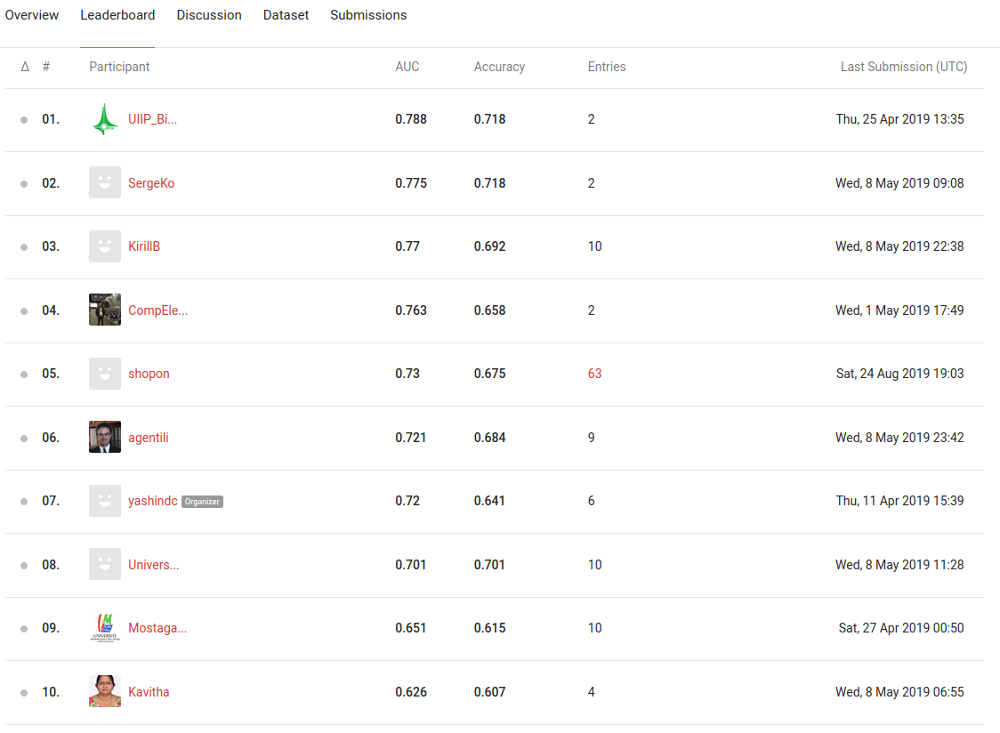

### Tuberculosis severity estimation

Code for paper titled *Tuberculosis Severity Estimation from
Volumetric CT scans using Uniformizing Techniques and 3D Convolutional Networks*.


This work is evaluated on CLEF evaluation: ImageCLEF 2019 Tuberculosis - Severity scoring challenge.The challenge was dedicated to the analysis of 3D Computed Tomography (CT) image data of tuberculosis (TB) patients.

### Usage

This work is implemented in Python 3.6 and Keras using Tensorflow as backend.

### Dependencies

Tested code using:

*    Ubuntu 14.04
*    Windows 8
*    Python 3.6

### Directory Structure & Usage
* `main`: Contains codes to replicate experiments
* `others`: Contains helper codes to preprocess and visualize samples in dataset.

### Post challenge submission

Our approach attains 5-th position overall.


<p align="center">
  <a href="#"></a>
</p>


### This work is an extension of previous work

More details at this [link](https://github.com/hasibzunair/tuberculosis-severity)


```
Zunair,  H.,  Rahman,  A.,  Mohammed,  N.:   Estimating  Severity  from  CT  Scans
of  Tuberculosis  Patients  using  3D  Convolutional  Nets  and  Slice  Selection.   In:
CLEF2019  Working  Notes.  Volume  2380  of  CEUR  Workshop  Proceedings.,
Lugano, Switzerland, CEUR-WS.org
<http://ceur-ws.org/Vol-2380>(September 9-12 2019) 
```
Previous paper published in CEUR-WS. Paper can be found at [CLEF Working Notes 2019](http://www.dei.unipd.it/~ferro/CLEF-WN-Drafts/CLEF2019/) under the section ImageCLEF - Multimedia Retrieval in CLEF.

More details coming soon...
