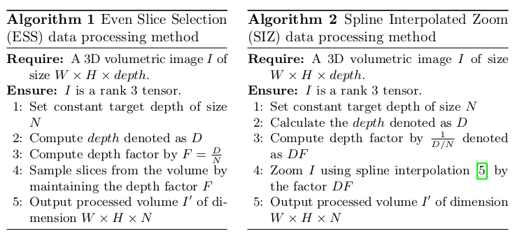
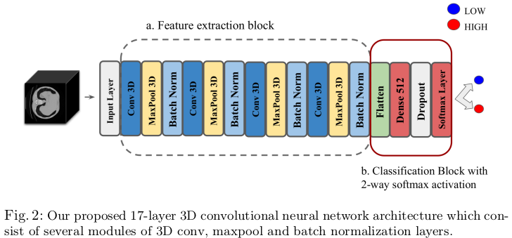
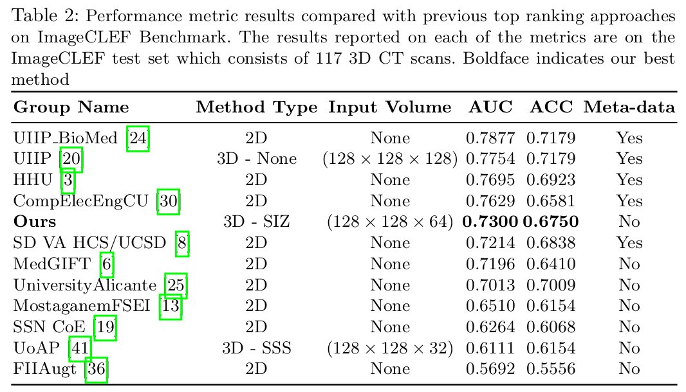

# Uniformizing Techniques to Process CT scans with 3D CNNs for Tuberculosis Prediction

This is official code of MICCAI'2020 PRIME workshop paper: ([Paper](https://link.springer.com/chapter/10.1007%2F978-3-030-59354-4_15), [arXiv](https://arxiv.org/abs/2007.13224))

### Virtual Oral Presentation
[](https://www.youtube.com/watch?v=IP6poudyny4)


### Citation
If you use this code or models in your scientific work, please cite the following paper:

```bibtex
@inproceedings{zunair2020uniformizing,
  title={Uniformizing Techniques to Process CT Scans with 3D CNNs for Tuberculosis Prediction},
  author={Zunair, Hasib and Rahman, Aimon and Mohammed, Nabeel and Cohen, Joseph Paul},
  booktitle={International Workshop on PRedictive Intelligence In MEdicine},
  pages={156--168},
  year={2020},
  organization={Springer}
}
```


### Data Processing Method

Data uniformizing methods

<p align="left">
<a href="#"></a>
</p>

### 3D Convolutional Neural Network

<p align="left">
<a href="#"></a>
</p>


### Results

<p align="left">
<a href="#"></a>
</p>

### Dependencies

*    Ubuntu 14.04
*    Python 3.6
*    Tensorflow: 2.0.0
*    Keras: 2.3.1

### Environment setup

You can create the appropriate conda environment by running

`conda env create -f environment.yml`


### Directory Structure & Usage

First, get the data from [here](https://www.imageclef.org/2019/medical/tuberculosis). Then:

* Run notebooks in order
* `others`: Contains helper codes to preprocess and visualize samples in dataset.

### Demo

A 🤗 Spaces demo for detecting pneumonia from CT scans using our [method](https://keras.io/examples/vision/3D_image_classification/) is available [here](https://huggingface.co/spaces/keras-io/3D_CNN_Pneumonia). Demo built by [Faizan Shaikh](https://github.com/faizankshaikh).

### This is an extension of previous work

More details at this [link](https://github.com/hasibzunair/tuberculosis-severity)

```bibtex
Zunair,  H.,  Rahman,  A.,  Mohammed,  N.:   Estimating  Severity  from  CT  Scans
of  Tuberculosis  Patients  using  3D  Convolutional  Nets  and  Slice  Selection.   In:
CLEF2019  Working  Notes.  Volume  2380  of  CEUR  Workshop  Proceedings.,
Lugano, Switzerland, CEUR-WS.org
<http://ceur-ws.org/Vol-2380>(September 9-12 2019) 
```
Previous paper published in CEUR-WS. Paper can be found at [CLEF Working Notes 2019](http://www.dei.unipd.it/~ferro/CLEF-WN-Drafts/CLEF2019/paper_77.pdf) under the section ImageCLEF - Multimedia Retrieval in CLEF.


### License

Your driver's license.


